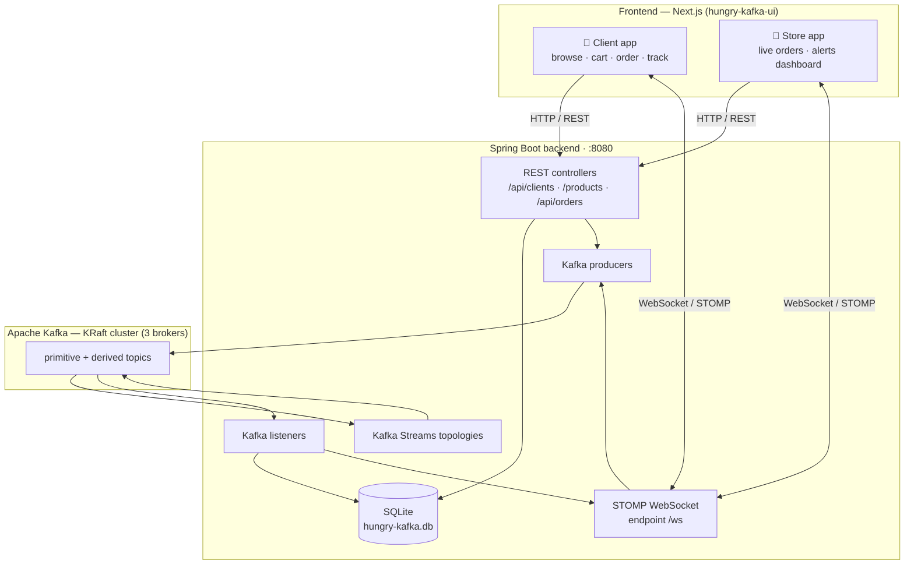
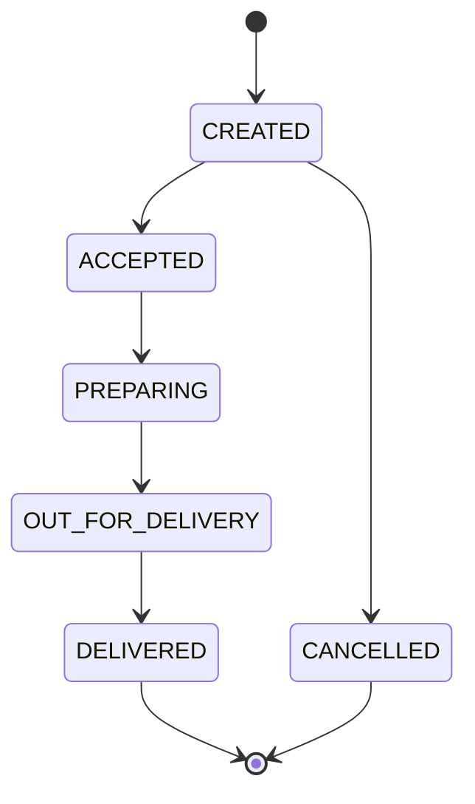
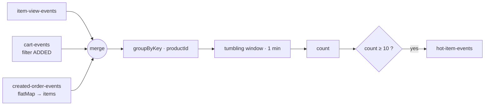
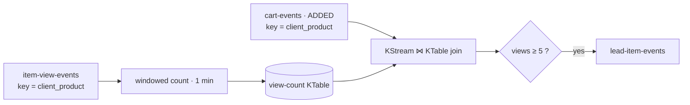
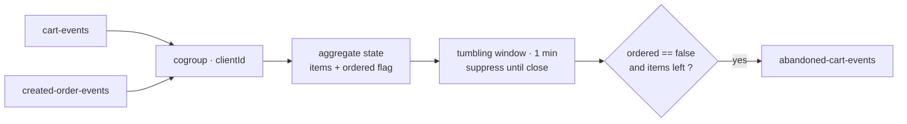

# 🍔 Hungry Kafka

> A real-time, event-driven food-delivery platform built on **Apache Kafka** and **Kafka Streams**.

Hungry Kafka is the backend of a food-delivery application that is *event-driven from end to end*. Every user action — viewing a dish, filling a cart, placing an order, a store advancing its status — becomes an **event** on Kafka. **Kafka Streams** topologies correlate those events into *situations of interest* (a dish going viral, a customer about to buy, a cart being abandoned) and react in real time: live store alerts, streaming order updates, and per-customer catalog personalization.

Developed for the **"Sistemas Orientados a Eventos" (Event-Driven Systems)** course at **UFES**. The web front-end (Next.js) lives in a separate project, [`hungry-kafka-ui`](https://github.com/mateus-sartorio/hungry-kafka-ui).


---

## ✨ What it does

The platform is split into two experiences, both served by this single backend:

**🧑 Customer app**
- Browse a food catalog, **ranked per customer** by inferred preference.
- View product details, add/remove items to a cart, and place orders.
- **Track orders live** — every status change (accepted → preparing → out for delivery → delivered) streams in over a WebSocket, including the expected delivery time.

**🏪 Store app**
- A **live order feed** — new orders pop in the instant they are placed.
- Advance each order through its lifecycle; the customer sees the change immediately.
- A **real-time situations dashboard** fed by the stream-processing engine:
  - 🔥 **Hot Item** — a product getting an unusual burst of attention right now.
  - 🎯 **Hot Lead** — a customer who repeatedly viewed a product and just added it to the cart (high purchase intent).
  - 🛒 **Abandoned Cart** — a customer who filled a cart but did not check out in time.

Under the hood, the interesting part is **how** those situations are detected: not by polling the database, but by continuously processing event streams with windowing, joins and aggregations — i.e. **Complex Event Processing (CEP)**.

---

## 🏗 Architecture



---

## 📨 Event model & Kafka topics

Topics come in two families. **Primitive** topics carry raw user actions; **derived** topics carry the higher-level situations inferred by Kafka Streams.

| Topic | Family | What it carries |
| --- | --- | --- |
| `item-view-events` | primitive | A customer viewed a product. |
| `cart-events` | primitive | A customer added or removed a product from their cart. |
| `created-order-events` | primitive | A customer placed an order. |
| `update-order-status-events` | primitive | A store advanced an order's status. |
| `hot-item-events` | derived | A product is getting an unusual burst of attention. |
| `lead-item-events` | derived | A customer shows high intent to buy a product. |
| `abandoned-cart-events` | derived | A customer filled a cart but did not check out in time. |

---

## 📦 Order lifecycle

Orders are created over REST but advanced over WebSocket → Kafka, so status changes are asynchronous and auditable. The handler enforces a strict **state machine** and rejects illegal transitions.



---

## 🎛 Recommendation system

The primitive-event consumers **infer knowledge** and feed it back into the product experience, ranking each customer's catalog by their inferred taste.

- Every **view**, **cart-add** and **order** bumps that client's **category** and **product** preference multipliers (`client_category_preference`, `client_product_preference`), each interaction type weighted differently:

  | Interaction | Multiplier (`app.preference.*`) |
  | --- | --- |
  | Item view | `× 1.05` |
  | Add to cart | `× 1.01` |
  | Order placed | `× 1.10` |

- When the catalog is requested (`GET /products/{clientId}`), each product's priority is `productPreference × categoryPreference`, and the list is returned **sorted by that score** — so the more a customer engages with a kind of food, the higher it floats in their catalog.

---

## 🧠 Situations of interest (Kafka Streams / CEP)

Each situation is a self-contained **topology** (`StreamsBuilder`) wired up by Spring. Together they showcase both **stateless** and **stateful** DSL operations, temporal **windows**, **joins** and **aggregations**.

### 🔥 Hot Item — a trending product

Merge every kind of interaction with a product (views + cart-adds + ordered items), count them per product in a **1-minute tumbling window**, and flag any product that crosses a threshold. This is the "composite event" built by fusing three different primitive streams.



### 🎯 Hot Lead — a customer about to buy

Count how many times a customer viewed a *specific* product in a recent window, materialize that as a **KTable**, then **join** it against the cart-add stream keyed by `client_product`. If someone adds to cart a product they had just been viewing repeatedly, they are a hot lead.



### 🛒 Abandoned Cart — intent that fizzled out

**Co-group** cart events and order events per customer inside a window, aggregating a small state (`{ productIds, ordered }`). Using `suppress`, results are emitted **only when the window closes** — and only if no order arrived. That "start event not followed by a terminating event within the interval" is the textbook temporal pattern.



---

## 🚀 Running the project

### Prerequisites

- **JDK 26**
- **Docker** + **Docker Compose**
- **Node.js 20+** (for the front-end)

> [!TIP]
> When setting up Java for this project, it is recommended to use JDK 25 (or newer) with SDKMAN.
>
> To install SDKMAN:
> `curl -s "https://get.sdkman.io" | bash`
>
> Then open a new terminal and check the active Java version:
> `java --version`
>
> To list available Java versions in SDKMAN:
> `sdk list java`
>
> To install a version (example):
> `sdk install java 26-oracle`
>
> To select the installed version for the current session:
> `sdk use java 26-oracle`
>
> To set it as the default version:
> `sdk default java 26-oracle`

### 1. Start the Kafka cluster

From the repository root:

```bash
docker compose up -d
```

This launches three KRaft-mode brokers (`broker1`, `broker2`, `broker3`). The application connects to `broker1` on `localhost:9092`.

### 2. Run the backend

```bash
mvn spring-boot:run
```

On startup the app will, in order: run **Flyway** migrations (creating and seeding `hungry-kafka.db`), wait for Kafka to become reachable (`KafkaStartup`), create all topics (`KafkaTopicConfig`), and start the **Kafka Streams** topologies. The API and WebSocket endpoint are then available on **`http://localhost:8080`**.

### 3. Run the front-end

The UI is a separate project — [`hungry-kafka-ui`](https://github.com/mateus-sartorio/hungry-kafka-ui). See its README for setup and run instructions.

---

## ⚙️ Configuration reference

All tunables live in [`src/main/resources/application.yml`](src/main/resources/application.yml):

| Key | Default | Meaning |
| --- | --- | --- |
| `spring.kafka.bootstrap-servers` | `localhost:9092` | Broker to connect to |
| `app.kafka.startup.max-retries` / `retry-delay-ms` | `20` / `1000` | How long to wait for Kafka on boot |
| `app.hot-item.threshold` / `window-minutes` | `10` / `1` | Hot Item sensitivity |
| `app.hot-lead.view-threshold` / `view-window-minutes` | `5` / `1` | Hot Lead sensitivity |
| `app.abandoned-cart.window-minutes` | `1` | Abandoned-cart window length |
| `app.preference.{itemview,cart,order}.multiplier` | `1.05` / `1.01` / `1.10` | Personalization weights |
